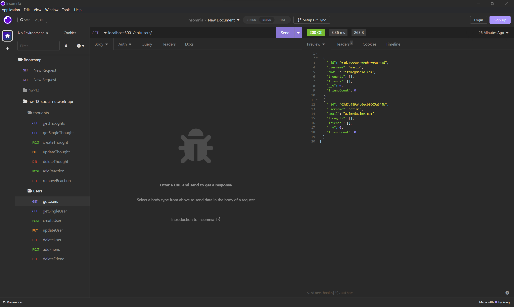

# social-network-api-with-mongoose

## Description

A back end application to create, update, delete, and check users and thoughts. You can add friends to users and reactions to thoughts.

## Table of Contents

- [Installation](#installation)
- [Usage](#usage)
- [Credits](#credits)
- [License](#license)

## Installation

- express version 4.18.2
- mongoose version 6.9.0

## Usage

Create users and add friends to the users' friends list. Each user can also create thoughts and even reactions to thoughts.

video: https://drive.google.com/file/d/1I6GKgxLonDfr0ERhCSuxBi3cDTs4mH6M/view?usp=share_link

## Credits

- Rutgers University Coding Bootcamp

## License

N/A